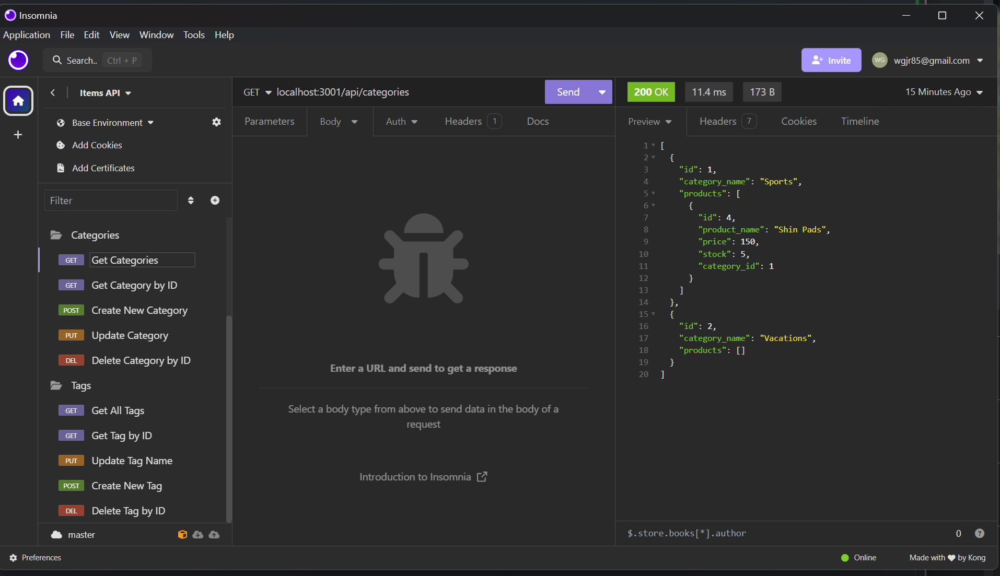

# ECommerce_BackEndWJr

## Description

In this challenge we completed code to create an E-Commerce Back End. We wrote the routes the models and the seeds. Using Insomnia we created new categories, products and tags. In our routes we wrote code to allow anyone using the database to get, put and delete either/or a category, a product or a tag. This assignment was very helpful in helping me to better understand the Back-Enf of programming.

## Repository

Link to walkthrough: https://drive.google.com/file/d/106mquV1ST3C-HqjsB0JXWd0yX1qZYcV7/view

## Technologies

- Written with JavaScript and SQL

## License

MIT License

## Mock-Up

The following image shows the application's functionality and appearance:

